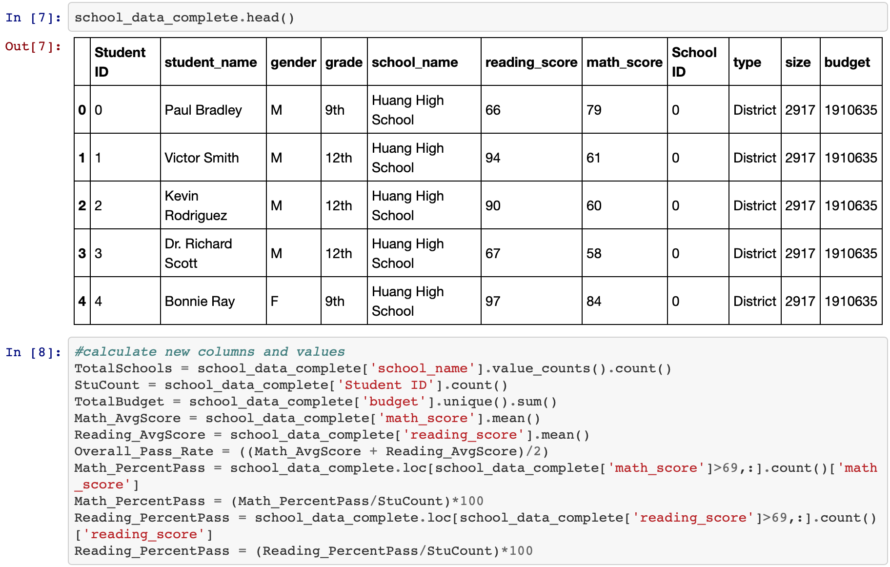

# Pandas Programming Challenge- Py City Schools Student Data
Utilized Pandas and Python to create dictionaries and dataframes of student data.  Calculating student averages other statistics to create tables displaying varying combos of information.

The following was performed in the Jupyter Notebook.

##District and School Summary
Calculate the total number of schools, total number of students, total budget, average math score, average reading score, overall passing rate (overall average score), percentage of students with a passing math and/or reading score (70 or greater)
Create a dataframe to hold the above results and give the displayed data cleaner formatting

##Scores by School Spending
Create a table that breaks down school performances based on average Spending Ranges (Per Student). Use 4 reasonable bins to group school spending. 

##Top and Bottom Performing Schools (By Passing Rate)

##Scores by School Size and Type

##Scores by Grade
Create a table that lists the average Math Score for students of each grade level (9th, 10th, 11th, 12th) at each school.
Create a pandas series for each grade using a conditional statement.

